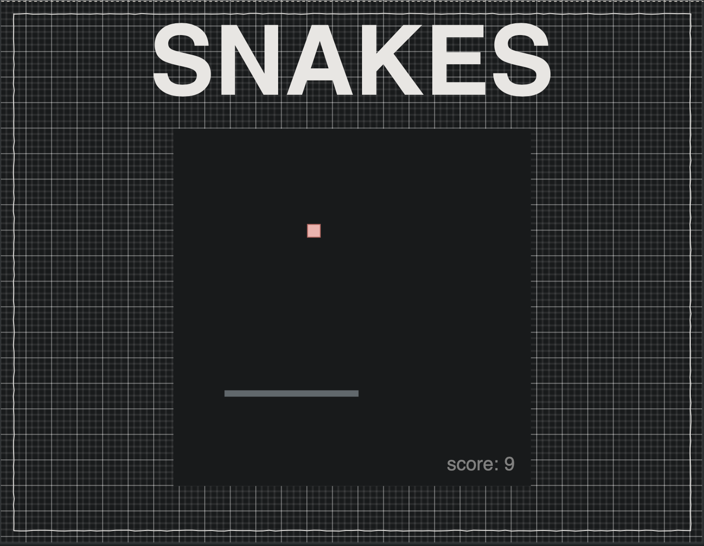
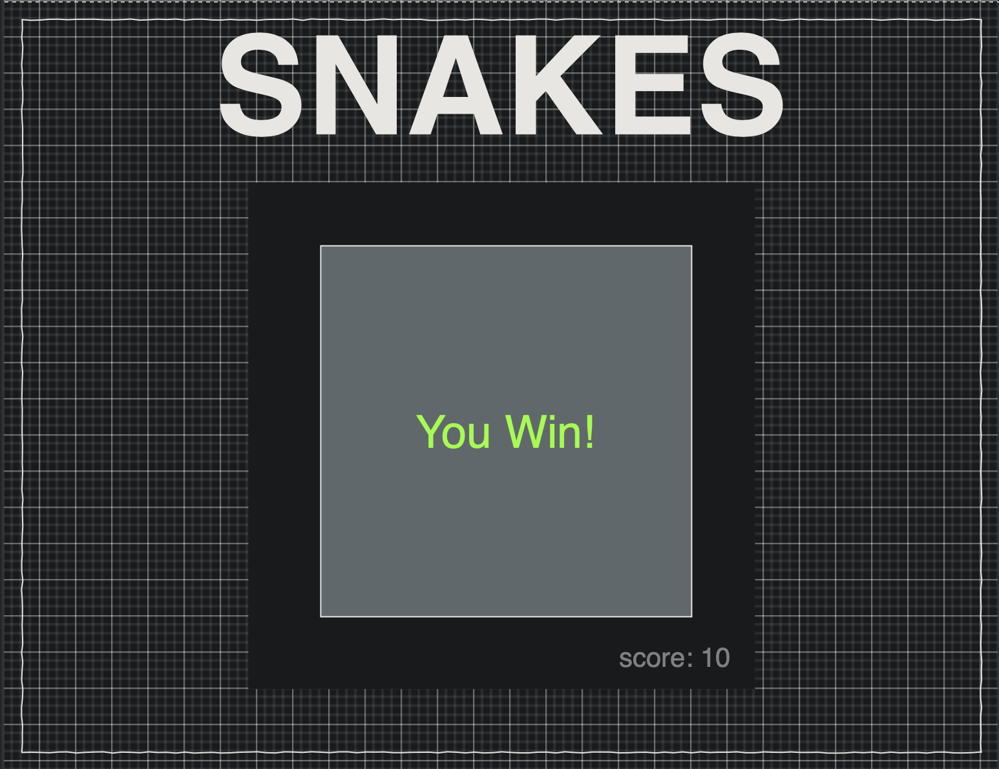

# Game Idea

- **OBJECTIVE:** is for the 🐍*(snake)* to eat the 🔸*(block)*.
- **DIFFICULTY:** When the 🐍 eats the 🔸 it grows **LONGER** and gets **FASTER**.
- **WALL:** 🐍 keeps moving until you *turn* or *hit* the ***wall***.
- **END:** When the 🐍 hits the ***wall*** game *ends*, OR if the 🐍 bites himself.
- **WIN:** When the 🐍 eats 10 🔸 you *win*.

# **Tech Stack:**

`HTML + CSS + JS`

# Wireframes

### Main *Elements* List :

- 🐍 *(snake)*
- 🔸 *(block)*
- 🧱 **Wall**

### Other *Elements* List:

- 🐍 GROWTH
- 🐍 SPEED
- Eat + Score (Max 10) (track)

### Windows:

<`Splash`💦>

<`GAME`👾>

<`WIN`🏁> / <`END`🛑>

# MVP Goals

- Splash + User Interface (Dave Stach - Garbage Boy)
- Block characters
- Most Functionality:
    - Wall 🧱
    - Score 1️⃣0️⃣
- 🐍 ***GROWTH? (1-10)***

# Stretch Goals

- 🐍 ***SPEED?***
- Animations (direction change warp)
- Characters
    - 🐍
    - 🍎 Food

# Warp Animation:

Format: 